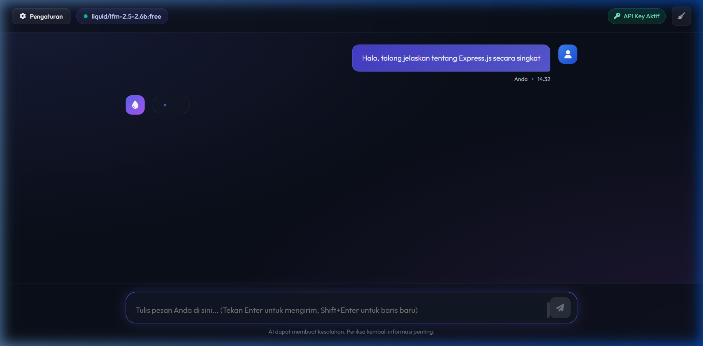
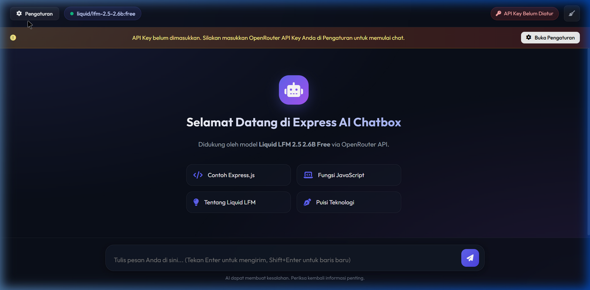

# Express AI Chatbox - Liquid LFM 2.5 (`liquid/lfm-2.5-2.6b:free`)

### 👤 Identitas Pembuat
- **Nama**: Ilham Saputra
- **NIM**: 20240140118
- **Praktikum**: Pengembangan Web Service (Praktikum 10)

---

Aplikasi Web Chatbot AI modern berbasis **Node.js & Express.js** yang mengintegrasikan model kecerdasan buatan **Liquid LFM 2.5 2.6B Free** (`liquid/lfm-2.5-2.6b:free`) menggunakan **OpenRouter API**.

Projek ini dilengkapi antarmuka pengguna (*User Interface*) bergaya **Glassmorphism Dark Mode**, dukungan Markdown rendering, *code syntax highlighting* dengan tombol salin kode, serta fitur penyembunyian panel pengaturan (*collapsible settings drawer*).

---

## 📸 Tangkapan Layar (Screenshots)

| Tampilan Utama Chatbot | Panel Pengaturan (API Key & Model) |
| :---: | :---: |
|  |  |

---

## ✨ Fitur Utama

- 🤖 **Integrasi Model AI Liquid LFM 2.5 2.6B**: Menghubungkan Express server ke model `liquid/lfm-2.5-2.6b:free` via OpenRouter API.
- 🎨 **Modern Glassmorphism Design**: Antarmuka dark mode yang indah, responsif, dan futuristik dengan Google Fonts (*Outfit* & *Fira Code*).
- 🔑 **Pengaturan API Key Fleksibel**: Pengguna dapat menginputkan OpenRouter API Key langsung melalui UI web (tersimpan aman di *Local Storage*) atau melalui file `.env`.
- ⚙️ **Panel Pengaturan Collapsible**: Drawer pengaturan yang dapat disembunyikan/ditampilkan kapan saja dengan tombol `⚙️ Pengaturan`.
- 📝 **Markdown & Code Syntax Highlighting**: Balasan AI dirender dalam format Markdown rapi lengkap dengan *syntax highlighting* (Highlight.js) dan tombol **Salin Kode**.
- 💬 **Multi-Turn Conversation & System Prompt**: Mendukung konteks percakapan bertahap serta penyesuaian karakter AI (*System Prompt*).

---

## 🛠️ Teknologi yang Digunakan

- **Backend**: Node.js, Express.js, Axios, Cors, Dotenv
- **Frontend**: HTML5, Vanilla CSS3 (Custom Glassmorphism Design), JavaScript (ES6+)
- **Libraries**:
  - [FontAwesome 6](https://fontawesome.com/) (Iconography)
  - [Marked.js](https://marked.js.org/) (Markdown Parser)
  - [Highlight.js](https://highlightjs.org/) (Syntax Highlighting)

---

## 🚀 Cara Menjalankan Projek Lokal

### 1. Prasyarat
Pastikan komputer Anda sudah terinstall **Node.js** (v16 atau versi lebih baru) dan **npm**.

### 2. Kloning Repositori
```bash
git clone https://github.com/ilham101106/118_OpenAI.git
cd 118_OpenAI
```

### 3. Install Dependensi
```bash
npm install
```

### 4. Menjalankan Server
```bash
npm start
```
Server akan berjalan di port `3000`.

### 5. Akses di Browser
Buka browser dan akses alamat berikut:
```
http://localhost:3000
```

---

## 🔑 Cara Penggunaan OpenRouter API Key

1. Dapatkan OpenRouter API Key gratis melalui halaman [OpenRouter Keys](https://openrouter.ai/keys).
2. Buat API Key baru dan salin kodenya (diawali dengan `sk-or-v1-...`).
3. Buka aplikasi di [http://localhost:3000](http://localhost:3000).
4. Klik tombol **`⚙️ Pengaturan`** di bagian atas kiri.
5. Tempelkan API Key pada kolom **OpenRouter API Key** lalu klik **Simpan Key**.
6. Mulai percakapan dengan AI!

---

## 📁 Struktur Direktori Projek

```
118_OpenAI/
├── package.json
├── server.js
├── .env.example
├── .env
├── README.md
├── screenshots/
│   ├── preview-chat.png
│   └── preview-settings.png
└── public/
    ├── index.html
    ├── style.css
    └── app.js
```

---

## 📄 Lisensi

Projek ini berlisensi MIT.
